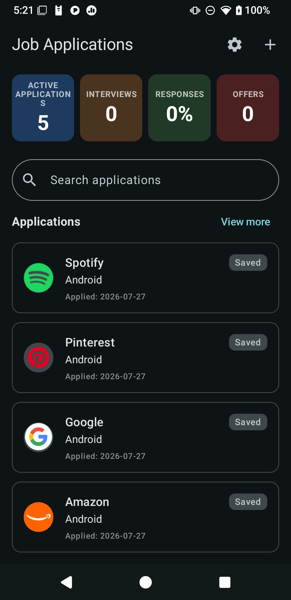
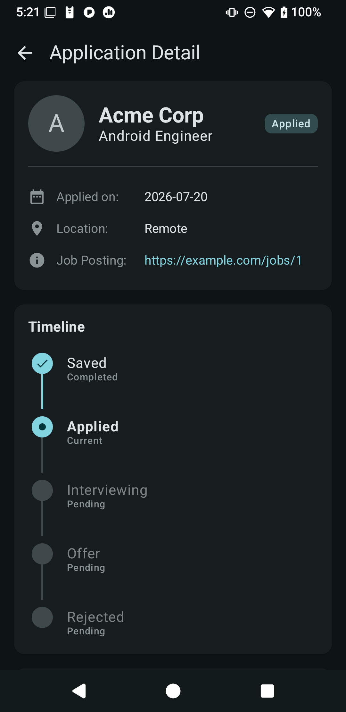

# JobTracker - Offline-First Android Application

JobTracker is a professional-grade Android application designed for managing job applications with a robust, offline-first synchronization engine. It demonstrates modern Android development practices, including Material 3 theming, Shared Element Transitions, and a reliable Single Source of Truth (SSOT) architecture.

## 📸 Screenshots

| Application List | Application Details |
| :---: | :---: |
|  |  |

## 🚀 Key Features

- **Offline-First Architecture**: View, create, and modify job applications without an internet connection.
- **Robust Synchronization**: Automatic background synchronization using WorkManager and GraphQL mutations.
- **Interactive Timeline**: A vertical tracker in the detail screen that visualizes the application lifecycle and allows for one-tap status updates.
- **Statistics Dashboard**: Real-time visual summary of job hunt progress, including active applications, interviews, response rates, and offers.
- **Conflict Resolution UI**: Interactive side-by-side comparison for resolving divergent local and server states.
- **User Theme Preference**: Persistent support for Light mode, Dark mode, or System Default, powered by Jetpack DataStore.
- **Modern UI/UX**: Built entirely with Jetpack Compose (1.7+), featuring:
    - **Shared Element Transitions**: Seamless container and element animations between list and details.
    - **Swipe-to-Delete**: Intuitive gesture-based item removal.
    - **Dynamic Company Logos**: Automated logo fetching based on job URLs using Coil 3.
- **Real-time Updates**: Support for GraphQL subscriptions to keep the local database in sync with remote changes.

## 🏗️ Architecture & Technology Stack

### Core Architecture
- **Single Source of Truth (SSOT)**: The local Room database is the authoritative source for the UI.
- **Unidirectional Data Flow (UDF)**: MVI-style state management using `StateFlow` and centralized event handling.
- **Repository Pattern**: Abstracts data sources and manages complex reconciliation logic.

### Technology Stack
- **UI**: Jetpack Compose (1.7.0+), Material Design 3.
- **Image Loading**: Coil 3 (Multiplatform-ready with OkHttp engine).
- **Local Database**: Room with Custom TypeConverters and atomic `@Transaction` support.
- **Remote API**: Apollo GraphQL (v5.0).
- **Background Tasks**: WorkManager with Hilt integration.
- **Persistence**: Jetpack DataStore (Preferences) for user settings.
- **Dependency Injection**: Hilt (Dagger).

## 🔄 Synchronization Engine

The app uses a sophisticated state machine and reliability layer to manage data consistency:

1.  **Idempotency Support**: Uses an `idempotencyKey` (local UUID) during creation to prevent duplicate entries on the server during network retries.
2.  **Atomic Transactions**: Employs Room Transactions to ensure that "local-to-server" ID swaps happen instantly, preventing items from flickering or disappearing from the UI.
3.  **Local Write**: Operations immediately update Room and mark the entity with a `SyncStatus`.
4.  **Version-Based Reconciliation**: Uses optimistic locking (version numbers) to detect divergent states.
5.  **Manual Conflict Resolution**: If the server rejects a change due to a version mismatch, the user is prompted to choose between versions via a comparison dialog.

## 📁 Project Structure

```text
com.dangle.jobtracker
├── data/
│   ├── local/          # Room Database, DAOs (with Transactions), and Entities
│   ├── network/        # Apollo GraphQL client configuration
│   ├── repository/     # SSOT implementation, Mappers, and Preference logic
│   └── worker/         # WorkManager Sync Workers with retry logic
├── di/                 # Hilt Modules (Database, Network, Dispatchers, DataStore)
├── domain/             # Pure Kotlin Domain Models, Enums, and Theme Config
├── ui/
│   ├── application/    # Creation, Detail screens, and Timeline components
│   ├── list/           # Application list, Dashboard, and Conflict UI
│   └── theme/          # M3 dynamic theming and Theme CompositionLocals
└── util/               # URL parsing, Connectivity monitoring, and Log utilities
graphql-server/         # Node.js GraphQL backend with Subscriptions and Idempotency logic
```

## 🧪 Testing Strategy

The project maintains high reliability through comprehensive testing:

- **DAO Tests**: Instrumented tests using an in-memory Room database to verify SQLite queries and atomic updates.
- **Repository Tests**: Unit tests using **MockK** and **Turbine** for Flow verification.
- **Worker Tests**: robolectric tests using `TestListenableWorkerBuilder` to verify retry behavior on network failure.

## 🛠️ Getting Started

### Prerequisites
- Android Studio Ladybug (or newer)
- JDK 17
- Node.js (for the mock backend)

### Backend Setup
```bash
cd graphql-server
npm install
npm start
```
The server runs at `http://localhost:4000/graphql`.

### Android App Configuration
Create `local.properties` and point it to your machine's IP (for emulator access):
```properties
api.url="http://<YOUR_IP_ADDRESS>:4000/graphql"
```

## 📄 License
This project is for demonstration and professional development purposes.
